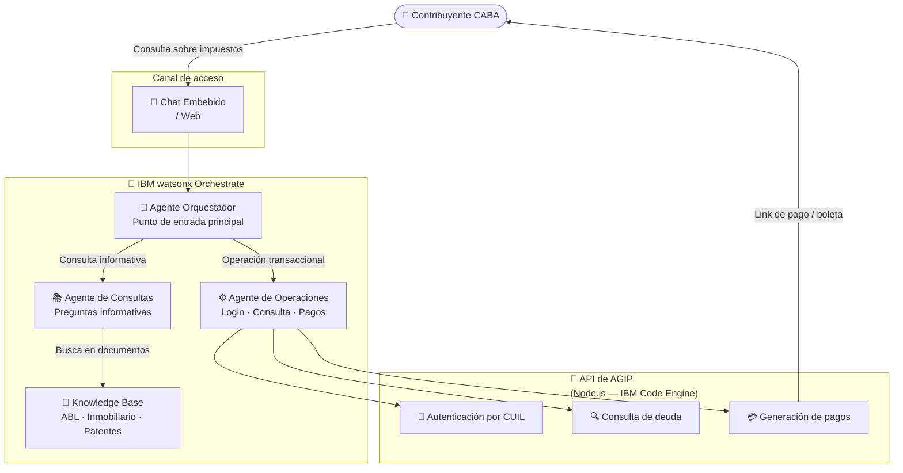

# AGIP

<div class="asset-header">
<div class="asset-meta">
  <span class="badge badge-active">✅ Activo</span>
  <span>🏛️ Gobierno · Ciudad de Buenos Aires</span>
  <span>🤖 IBM watsonx Orchestrate</span>
  <span>🇦🇷 Argentina</span>
</div>
</div>

## Descripción del caso

**AGIP** (Agencia de Recaudación de la Ciudad de Buenos Aires) atiende millones de consultas de contribuyentes por año relacionadas con impuestos municipales: ABL (Alumbrado, Barrido y Limpieza) e Inmobiliario, y Patentes Automotores.

El **problema central**: los contribuyentes necesitan consultar su estado de deuda, obtener boletas y gestionar pagos, pero los canales tradicionales (call center, oficinas presenciales) generan fricciones, largas esperas y altos costos operativos.

La **solución**: un sistema de agentes conversacionales construido sobre IBM watsonx Orchestrate que permite al contribuyente, desde cualquier canal digital, autenticarse con su CUIL, consultar sus deudas, obtener medios de pago y recibir su boleta por email — todo en una sola conversación, sin intervención humana.

---

## One-Pager

| Campo | Detalle |
|---|---|
| **Cliente** | AGIP — Agencia de Recaudación CABA |
| **Industria** | Gobierno / Sector Público |
| **País** | Argentina |
| **Estado** | ✅ Activo |
| **Productos IBM** | IBM watsonx Orchestrate |
| **Contacto CE** | Ignacio Ayerbe · Martina Pérez |

### El problema
Los contribuyentes de CABA necesitan consultar y pagar sus obligaciones tributarias (ABL e Inmobiliario, Patentes), pero los canales existentes requieren intervención humana, generan esperas y están limitados al horario de atención.

### La solución IBM
Tres agentes especializados en IBM watsonx Orchestrate — orquestador, operaciones y consultas frecuentes — que guían al contribuyente a través del flujo completo: autenticación por CUIL, consulta de deuda, selección de medio de pago y envío de boleta, disponible 24/7.

### Valor de negocio

- ✅ **Atención 24/7** sin costo adicional de recursos humanos
- ✅ **Reducción de fricciones** en el proceso de pago de impuestos municipales
- ✅ **Integración nativa** con la API de AGIP sin reescribir sistemas legados

---

## Arquitectura de la solución



| Componente | Tecnología IBM | Rol |
|---|---|---|
| Agente Orquestador | watsonx Orchestrate | Punto de entrada, detecta intención y delega |
| Agente de Operaciones | watsonx Orchestrate | Login, consulta de deuda y generación de pagos |
| Agente de Consultas FAQ | watsonx Orchestrate | Responde preguntas informativas |
| Knowledge Base | watsonx Orchestrate (KB) | Documentos: ABL, Inmobiliario, Patentes |
| API AGIP | Node.js — IBM Code Engine | Mock de la API de AGIP |

---

??? note "🔧 Guía técnica para engineers"

    **Stack:** Node.js 18 · IBM watsonx Orchestrate · IBM Code Engine · Docker

    **Repositorio con el código:** `pilotos/agip/` en este repo.

    La solución incluye una **mock API** en Node.js con endpoints de autenticación, consulta de deuda, medios de pago y envío de boletas. Los **tres agentes** de Orchestrate (orquestador, operaciones y consultas frecuentes) se configuran directamente en la plataforma.

    **Instalación local:**
    ```bash
    cd pilotos/agip/src/agip-mock-api
    npm install
    npm start
    # API disponible en http://localhost:8080
    # Swagger en http://localhost:8080/docs
    ```

    **Con Docker:**
    ```bash
    docker build -t agip-mock-api .
    docker run -p 8080:8080 agip-mock-api
    ```

    **Datos de prueba:**

    | CUIL | Contribuyente |
    |---|---|
    | `20301112220` | Carlos López |
    | `27289991110` | Ana Díaz |

    → Ver guía técnica completa en [`guia-tecnica.md`](../../pilotos/agip/guia-tecnica.md)
