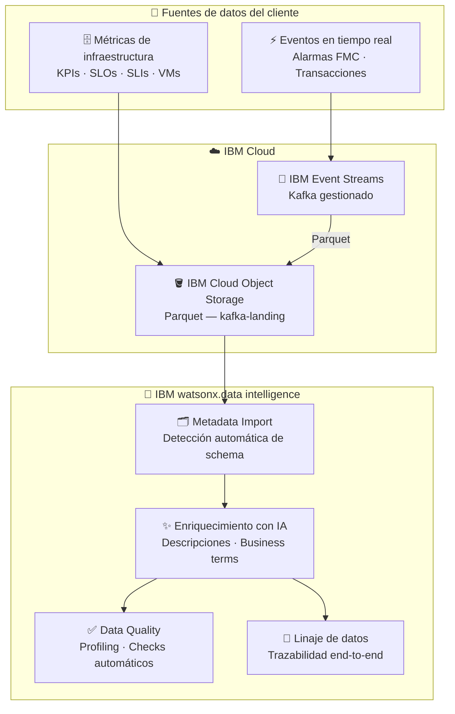

# Cliente Telco · Argentina

<div class="asset-header">
<div class="asset-meta">
  <span class="badge badge-in-progress">🔄 En proceso</span>
  <span>📡 Telco</span>
  <span>📊 IBM watsonx.data intelligence</span>
  <span>🇦🇷 Argentina</span>
</div>
</div>

## Descripción del caso

El cliente es uno de los principales proveedores de servicios de telecomunicaciones del país, con millones de clientes en servicios móviles, banda ancha y TV. La operación genera enormes volúmenes de datos de red, facturación e infraestructura que necesitan gobierno, calidad y trazabilidad para tomar decisiones confiables.

Este MVP aborda **dos casos de uso estratégicos** identificados en el proceso de discovery:

1. **KPI Móvil y Alarmas FMC** — Ingesta de eventos en tiempo real (Kafka) para monitoreo de KPIs de red y alarmas de servicio FMC, con catálogo y gobierno en watsonx.data intelligence.
2. **SLO/SLI y Linaje de VMs** — Gobierno y trazabilidad end-to-end de métricas de infraestructura virtual para asegurar el cumplimiento de niveles de servicio.

---

## One-Pager

<a href="#" class="download-btn" style="opacity:0.5;cursor:not-allowed;" title="Próximamente">
  📎 One-Pager — próximamente disponible
</a>

| Campo | Detalle |
|---|---|
| **Cliente** | Cliente Telco — Argentina |
| **Industria** | Telecomunicaciones |
| **País** | Argentina |
| **Estado** | 🔄 En proceso |
| **Productos IBM** | IBM watsonx.data intelligence · IBM Event Streams · IBM Cloud Object Storage |
| **Contacto CE** | Ignacio Ayerbe · Martina Pérez |

### El problema
El cliente genera millones de eventos de red y facturación diariamente, pero la falta de gobierno de datos dificulta la confiabilidad de los KPIs, el monitoreo de SLOs/SLIs y la trazabilidad de los datos de infraestructura desde el origen hasta el reporte.

### La solución IBM
Un pipeline de datos en tiempo real (IBM Event Streams → IBM COS) con gobierno, calidad y enriquecimiento automático por IA en IBM watsonx.data intelligence — metadata, business terms, lineaje y checks de calidad sin intervención manual.

### Valor de negocio

- ✅ **Catálogo automático** de datos de red con metadata enriquecida por IA
- ✅ **Linaje end-to-end** desde la VM hasta el dashboard analítico
- ✅ **Calidad de datos automatizada** — profiling, business terms y checks sin trabajo manual

---

## Arquitectura de la solución



| Componente | Tecnología IBM | Rol |
|---|---|---|
| Ingesta en tiempo real | IBM Event Streams (Kafka) | Recibe eventos de facturación y alarmas de red |
| Almacenamiento | IBM Cloud Object Storage | Aterriza los datos como Parquet |
| Catálogo y gobierno | IBM watsonx.data intelligence | Metadata, enriquecimiento con IA, gobierno |
| Calidad de datos | watsonx.data intelligence (DQ) | Monitoreo automático de SLOs/SLIs |
| Linaje | watsonx.data intelligence (Lineage) | Trazabilidad desde VM hasta dashboard |

---

??? note "🔧 Guía técnica para engineers"

    **Stack:** Python 3.11 · IBM Event Streams (Kafka) · IBM Cloud Object Storage · IBM watsonx.data intelligence

    El proyecto incluye dos componentes técnicos:

    **Demo-APIs:** App Streamlit que demuestra las capacidades de watsonx.data intelligence vía APIs.
    ```bash
    pip install -r requirements.txt
    streamlit run app.py
    ```

    **Kafka-demo:** Pipeline productor/consumidor que publica eventos de facturación en Kafka y los aterriza como Parquet en COS.
    ```bash
    python producer.py          # Publica 100 eventos de facturación simulados
    python consumer_to_cos.py   # Consume y sube a IBM COS como Parquet
    ```

    → Guía técnica completa disponible en el repositorio: `pilotos/telecom/guia-tecnica.md`
