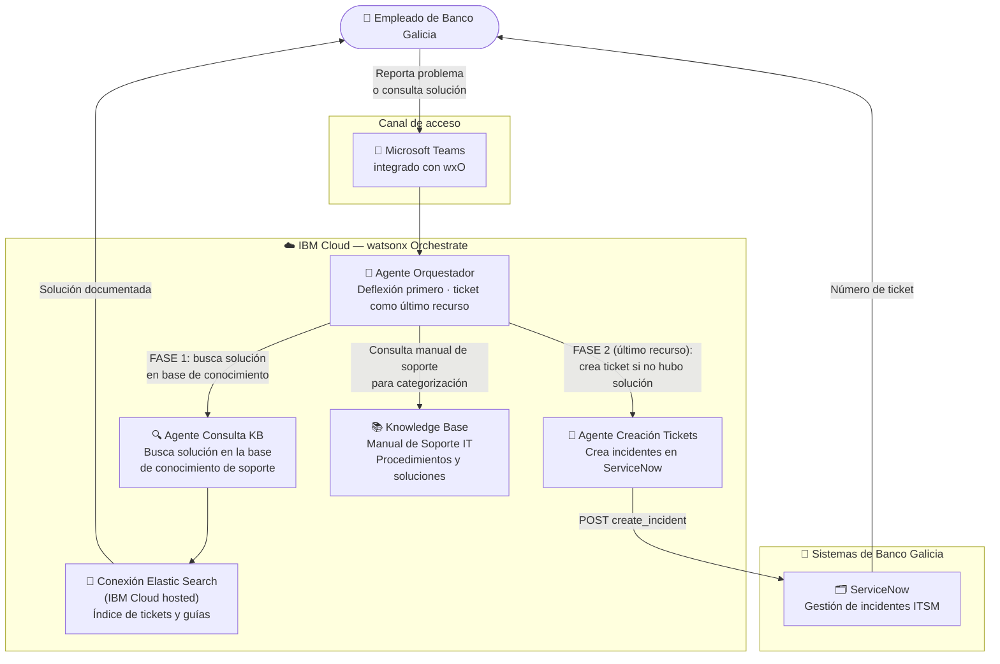

# Galicia

  ✅ Activo
  🏦 Banca
  🤖 IBM watsonx Orchestrate
  🇦🇷 Argentina

## Descripción del caso

**Banco Galicia** cuenta con miles de empleados que dependen del soporte IT interno para resolver incidentes tecnológicos en su operación diaria. El proceso tradicional de reporte — llamar al helpdesk, abrir un ticket manualmente en ServiceNow — genera demoras, errores de categorización y frustración.

La **solución**: un sistema multi-agente en **IBM watsonx Orchestrate** integrado directamente en **Microsoft Teams**, el canal de trabajo diario del banco. El sistema tiene dos capacidades principales:

1. **Deflexión de tickets**: antes de abrir un ticket, el agente busca automáticamente en la **base de conocimiento de soporte** (almacenada en Elastic Search en IBM Cloud) si ya existe una solución documentada para el problema. Sólo si no hay solución, se avanza a crear el incidente.
2. **Creación de tickets**: recopila los datos del incidente en lenguaje natural y crea el ticket en **ServiceNow** con categoría, urgencia e impacto correctamente asignados.

---

## One-Pager

<a href="../../assets/onepagers/OnePage_Galicia.pdf" class="download-btn" download>
  📥 Descargar One-Pager (PDF)
</a>

| Campo | Detalle |
|---|---|
| **Cliente** | Banco Galicia |
| **Industria** | Banca / Servicios Financieros |
| **País** | Argentina |
| **Estado** | ✅ Activo |
| **Productos IBM** | IBM watsonx Orchestrate · Elastic Search (IBM Cloud) |
| **Contacto CE** | Ignacio Ayerbe · Martina Pérez |

### El problema
Los empleados del banco pierden tiempo reportando incidentes IT por canales desarticulados. La apertura manual de tickets en ServiceNow es lenta, propensa a errores de categorización y requiere salir del flujo de trabajo. Además, muchos tickets podrían resolverse con documentación existente, pero esa base de conocimiento no es fácilmente accesible.

### La solución IBM
Un agente orquestador en watsonx Orchestrate integrado en Teams que primero intenta resolver el problema mediante búsqueda en la base de conocimiento de soporte (Elastic Search, hosteado en IBM Cloud). Solo si no hay solución, guía al empleado para crear el ticket en ServiceNow con todos los datos correctamente estructurados.

### Valor de negocio

- ✅ **Deflexión de tickets** — la mayoría de los problemas se resuelven sin abrir un incidente
- ✅ **Reducción del tiempo de apertura** de tickets — de minutos a segundos, sin salir de Teams
- ✅ **Categorización automática** de incidentes según el manual de soporte del banco
- ✅ **Canal único** integrado en el entorno de trabajo existente

---

## Arquitectura de la solución

| Componente | Tecnología | Rol |
|---|---|---|
| Agente Orquestador | IBM watsonx Orchestrate (native) | Deflexión de tickets: busca solución antes de crear incidente |
| Agente Consulta KB | IBM watsonx Orchestrate (native) | Busca en Elastic Search (IBM Cloud) guías y soluciones documentadas |
| Agente Creación Tickets | IBM watsonx Orchestrate (native) | Crea incidentes en ServiceNow con datos estructurados |
| Elastic Search (IBM Cloud) | Elastic Search — IBM Cloud hosted | Base de conocimiento de soporte: manuales, guías y soluciones por categoría |
| ServiceNow | ServiceNow — Banco Galicia | ITSM del banco para gestión de incidentes |
| Canal | Microsoft Teams | Interfaz conversacional integrada en el flujo de trabajo |

---

??? note "🔧 Guía técnica para engineers"

    **Stack:** IBM watsonx Orchestrate (native agents) · Elastic Search (IBM Cloud) · ServiceNow API · Microsoft Teams

    La solución usa **tres agentes nativos** (YAML) en watsonx Orchestrate. El agente de Elastic Search accede a la base de conocimiento mediante una **Knowledge Base connection** (`Elastic_Search_connection_0310mi`) que conecta con la instancia de Elastic Search hosteada en IBM Cloud — no en los sistemas de Galicia.

    **Agentes incluidos:**

    | Agente | Archivo YAML |
    |---|---|
    | Orquestador | `Agente_Orquestador_911_RAG_6991Z0.yaml` |
    | Consulta KB (Elastic Search) | `Consulta_de_Tickets_Elastic_Search_3349Hj.yaml` |
    | Creación de tickets (ServiceNow) | `Creacion_de_tickets_ServiceNow_97899l.yaml` |

    **Nota importante:** La KB de Elastic Search contiene manuales de soporte IT en formato JSON con campos: `ID`, `descripción`, `link a ServiceNow` y `fecha de actualización`.

    → Guía técnica completa: `pilotos/galicia/guia-tecnica.md`
