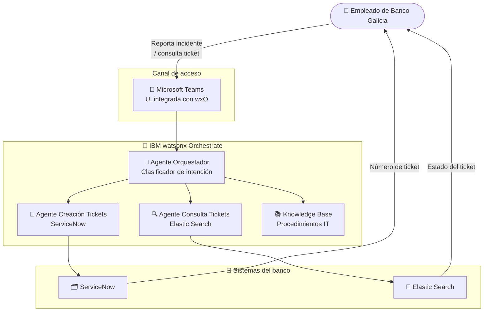

# Galicia

  ✅ Activo
  🏦 Banca
  🤖 IBM watsonx Orchestrate
  🇦🇷 Argentina

## Descripción del caso

**Banco Galicia** cuenta con miles de empleados que dependen del soporte IT interno para resolver incidentes tecnológicos en su operación diaria. El proceso tradicional de reporte de incidentes — llamar al helpdesk, abrir un ticket en ServiceNow manualmente — genera demoras, errores de categorización y frustración en el empleado.

La **solución**: un sistema multi-agente en IBM watsonx Orchestrate integrado directamente en **Microsoft Teams**, el canal de trabajo diario de los empleados. El agente permite reportar un nuevo incidente en lenguaje natural, que se convierte automáticamente en un ticket en **ServiceNow**, o consultar el estado de un ticket existente buscando en **Elastic Search** — todo sin salir del chat.

---

## One-Pager

| Campo | Detalle |
|---|---|
| **Cliente** | Banco Galicia |
| **Industria** | Banca / Servicios Financieros |
| **País** | Argentina |
| **Estado** | ✅ Activo |
| **Productos IBM** | IBM watsonx Orchestrate |
| **Contacto CE** | Ignacio Ayerbe · Martina Pérez |

### El problema
Los empleados del banco pierden tiempo reportando incidentes IT por canales desarticulados. La apertura manual de tickets en ServiceNow es lenta, propensa a errores de categorización y requiere salir del flujo de trabajo.

### La solución IBM
Un agente orquestador en watsonx Orchestrate integrado en Teams que clasifica la intención del empleado y delega: crea tickets en ServiceNow o consulta el historial en Elastic Search, sin fricciones y en lenguaje natural.

### Valor de negocio

- ✅ **Reducción del tiempo de apertura de tickets** — de minutos a segundos, sin salir de Teams
- ✅ **Categorización automática** de incidentes para mejor routing al equipo correcto
- ✅ **Canal único de soporte** integrado en el entorno de trabajo existente

---

## Arquitectura de la solución

| Componente | Tecnología IBM | Rol |
|---|---|---|
| Agente Orquestador | watsonx Orchestrate | Clasifica intención y delega al agente correcto |
| Agente Consulta Tickets | watsonx Orchestrate | Busca estado de tickets vía Elastic Search |
| Agente Creación Tickets | watsonx Orchestrate | Crea incidentes en ServiceNow |
| Knowledge Base | watsonx Orchestrate (KB) | Documentación interna y procedimientos IT |
| Canal | Microsoft Teams | Interfaz conversacional en el entorno de trabajo |

---

??? note "🔧 Guía técnica para engineers"

    **Stack:** IBM watsonx Orchestrate · ServiceNow API · Elastic Search API · Microsoft Teams

    La solución consiste en **tres agentes nativos de Orchestrate** (YAML) y una **knowledge base** con documentación interna. La integración con Teams se hace a través del canal nativo de watsonx Orchestrate para Microsoft.

    **Agentes incluidos:**

    | Agente | Archivo |
    |---|---|
    | Agente Orquestador | `Agente_Orquestador_911_RAG_6991Z0.yaml` |
    | Consulta de Tickets (Elastic Search) | `Consulta_de_Tickets_Elastic_Search_3349Hj.yaml` |
    | Creación de Tickets (ServiceNow) | `Creacion_de_tickets_ServiceNow_97899l.yaml` |

    → Guía técnica completa disponible en el repositorio: `pilotos/galicia/guia-tecnica.md`
