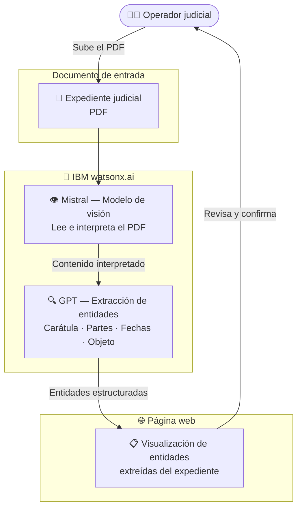

# GCBA Tribunales

  ✅ Activo
  ⚖️ Justicia / Gobierno
  🧠 IBM watsonx.ai
  🇦🇷 Argentina

## Descripción del caso

El **Gobierno de la Ciudad de Buenos Aires** gestiona miles de expedientes judiciales en los Tribunales de la Ciudad. El proceso de carga era completamente manual: los operadores extraían datos de PDFs judiciales a mano, lento y propenso a errores.

La **solución**: un pipeline de dos modelos de IA desplegado en **IBM watsonx.ai**. Un modelo de visión (**Mistral**) lee e interpreta el PDF del expediente; un modelo de extracción de entidades (**GPT**) identifica y estructura los datos clave — carátula, partes, fechas, objeto del proceso. Las entidades extraídas se visualizan en una **página web** diseñada para los operadores judiciales.

---

## One-Pager

<a href="#" class="download-btn" style="opacity:0.5;cursor:not-allowed;" title="Próximamente">
  📎 One-Pager — próximamente disponible
</a>

| Campo | Detalle |
|---|---|
| **Cliente** | Gobierno de la Ciudad de Buenos Aires (GCBA) |
| **Industria** | Gobierno / Justicia |
| **País** | Argentina |
| **Estado** | ✅ Activo |
| **Productos IBM** | IBM watsonx.ai |
| **Contacto CE** | Ignacio Ayerbe · Martina Pérez |

### El problema
Los operadores judiciales cargaban manualmente los datos de expedientes en PDF — carátula, partes, fechas, objeto del proceso — en el sistema interno. Un proceso lento, repetitivo y con alto riesgo de error humano.

### La solución IBM
Un pipeline de dos modelos en **IBM watsonx.ai**: **Mistral** (visión) interpreta el PDF del expediente y **GPT** extrae y estructura las entidades clave. Las entidades extraídas se presentan en una página web para que el operador las revise y confirme, eliminando la carga manual.

### Valor de negocio

- ✅ **Extracción automática** de entidades judiciales desde PDFs — sin carga manual
- ✅ **Pipeline de dos modelos** especializados: visión (Mistral) + extracción de entidades (GPT)
- ✅ **Visualización en página web** — el operador ve las entidades extraídas de forma inmediata
- ✅ **Reducción de errores** en la carga de datos de expedientes

---

## Arquitectura de la solución

| Componente | Tecnología | Rol |
|---|---|---|
| Modelo de visión | Mistral (IBM watsonx.ai) | Lee e interpreta el PDF del expediente judicial |
| Extracción de entidades | GPT (IBM watsonx.ai) | Identifica y estructura carátula, partes, fechas y objeto del proceso |
| Página web | Frontend web | Muestra las entidades extraídas al operador para revisión |

---

??? note "🔧 Guía técnica para engineers"

    **Stack:** IBM watsonx.ai · Mistral (visión) · GPT (extracción de entidades) · Python · Frontend web

    El pipeline procesa PDFs judiciales en dos pasos:
    1. **Mistral** recibe el PDF y lo interpreta con capacidades de visión
    2. **GPT** recibe el contenido interpretado y extrae las entidades clave como JSON estructurado (carátula, partes, fechas, objeto del proceso)
    3. La página web consume el JSON y presenta las entidades al operador

    **Documentos de referencia del proyecto:**

    - `Información del caso.docx` — descripción del caso de uso y requerimientos
    - `expediente ejemplo.pdf` — documento de ejemplo para pruebas (anonimizado)
