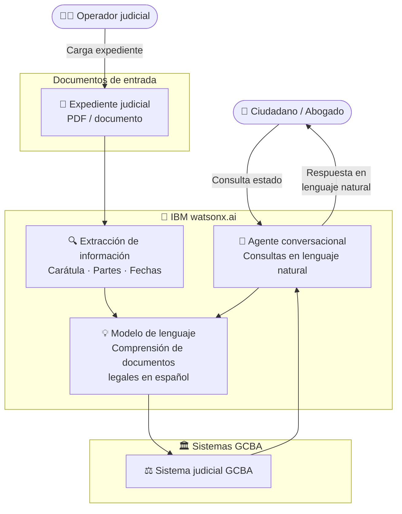

# GCBA Tribunales

  ✅ Activo
  ⚖️ Justicia / Gobierno
  🧠 IBM watsonx.ai
  🇦🇷 Argentina

## Descripción del caso

El **Gobierno de la Ciudad de Buenos Aires** gestiona miles de expedientes judiciales en los Tribunales de la Ciudad. El proceso actual implica navegación manual por sistemas complejos para consultar el estado de una causa, con barreras de acceso para ciudadanos y abogados que no conocen la jerga del sistema judicial.

La **solución**: un sistema de procesamiento inteligente de expedientes basado en **IBM watsonx.ai** que extrae automáticamente la información relevante de documentos judiciales (carátula, partes, objeto del proceso, fechas) y la hace accesible a través de un **agente conversacional** que responde en lenguaje natural — sin necesidad de navegar por el sistema judicial.

---

## One-Pager

| Campo | Detalle |
|---|---|
| **Cliente** | Gobierno de la Ciudad de Buenos Aires (GCBA) |
| **Industria** | Gobierno / Justicia |
| **País** | Argentina |
| **Estado** | ✅ Activo |
| **Productos IBM** | IBM watsonx.ai |
| **Contacto CE** | Ignacio Ayerbe · Martina Pérez |

### El problema
Los ciudadanos y abogados necesitan consultar el estado de sus expedientes judiciales navegando por sistemas complejos que requieren conocimiento técnico del proceso judicial y no están diseñados para el usuario final.

### La solución IBM
IBM watsonx.ai procesa los expedientes judiciales, extrae la información estructurada y la hace consultable a través de un agente conversacional que responde preguntas sobre el estado del proceso en lenguaje natural.

### Valor de negocio

- ✅ **Acceso democrático** a la información judicial sin barreras técnicas
- ✅ **Procesamiento automático** de documentos legales complejos
- ✅ **Reducción de consultas** presenciales a los juzgados

---

## Arquitectura de la solución

| Componente | Tecnología IBM | Rol |
|---|---|---|
| Extracción de información | IBM watsonx.ai | Procesa PDFs judiciales y extrae datos estructurados |
| Agente conversacional | IBM watsonx.ai | Responde consultas sobre expedientes en lenguaje natural |
| Modelo de lenguaje | IBM watsonx.ai (Granite / Llama) | Comprende y sintetiza documentos legales en español |
| Sistema judicial GCBA | Sistema legado GCBA | Repositorio central de expedientes |

---

??? note "🔧 Guía técnica para engineers"

    **Stack:** IBM watsonx.ai · Python · PDF processing

    La solución usa **IBM watsonx.ai** para procesar documentos judiciales en formato PDF, extraer información estructurada y responder preguntas en lenguaje natural sobre los expedientes.

    **Documentos de referencia del proyecto:**

    - `Información del caso.docx` — descripción del caso de uso y requerimientos
    - `expediente ejemplo.pdf` — documento de ejemplo para pruebas (anonimizado)

    → Guía técnica completa disponible en el repositorio: `pilotos/gcba-tribunales/guia-tecnica.md`
