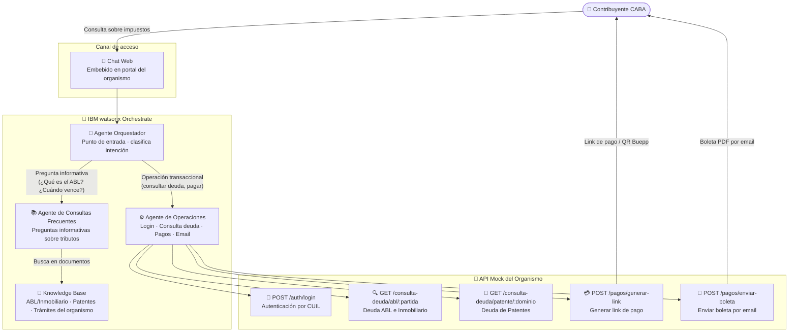

# Organismo Tributario · CABA

<div class="asset-header">
<div class="asset-meta">
  <span class="badge badge-active">✅ Activo</span>
  <span>🏛️ Gobierno · Ciudad de Buenos Aires</span>
  <span>🤖 IBM watsonx Orchestrate</span>
  <span>🇦🇷 Argentina</span>
</div>
</div>

## Descripción del caso

El **organismo tributario de la Ciudad de Buenos Aires** es el ente recaudador de CABA. Gestiona los principales tributos municipales que afectan a millones de contribuyentes:

- **ABL** (Alumbrado, Barrido y Limpieza): tributo bimestral que se paga por cada inmueble registrado bajo una *partida* ABL. Es el impuesto que financia los servicios de limpieza, iluminación y barrido de las calles de la Ciudad.
- **Inmobiliario**: impuesto sobre la propiedad inmueble (terrenos y edificios), también identificado por número de partida.
- **Patentes Automotores**: impuesto al parque automotor, identificado por el *dominio* (patente) del vehículo. Se paga en cuotas bianuales.

El **problema**: los contribuyentes necesitan consultar su estado de deuda, obtener boletas y gestionar pagos, pero los canales tradicionales (call center, oficinas presenciales) generan fricciones, largas esperas y están limitados al horario de atención.

La **solución**: un sistema de agentes conversacionales construido sobre **IBM watsonx Orchestrate** que permite al contribuyente, desde cualquier canal digital, autenticarse con su CUIL, consultar sus deudas por partida o dominio, seleccionar el medio de pago (tarjeta, billetera virtual, Buepp, plan de facilidades) y recibir su boleta por email — todo en una sola conversación, sin intervención humana, disponible 24/7.

---

## One-Pager

<a href="../../assets/onepagers/OnePage_AGIP.pptx" class="download-btn" download>
  📥 Descargar One-Pager (PowerPoint)
</a>

| Campo | Detalle |
|---|---|
| **Cliente** | Organismo Tributario — Ciudad de Buenos Aires |
| **Industria** | Gobierno / Sector Público |
| **País** | Argentina |
| **Estado** | ✅ Activo |
| **Productos IBM** | IBM watsonx Orchestrate · IBM Code Engine |
| **Contacto CE** | Ignacio Ayerbe · Martina Pérez |

### El problema
Los contribuyentes de CABA deben consultar y pagar sus obligaciones tributarias (ABL, Inmobiliario, Patentes) pero los canales disponibles requieren intervención humana, generan tiempos de espera y están limitados al horario comercial. No existe un canal digital conversacional que cubra el flujo completo de consulta + pago.

### La solución IBM
Tres agentes especializados en IBM watsonx Orchestrate — orquestador, operaciones y consultas frecuentes — que guían al contribuyente a través del flujo completo: autenticación por CUIL, consulta de deuda por partida o dominio, selección de medio de pago y envío de boleta, disponible 24/7.

### Valor de negocio

- ✅ **Atención 24/7** sin costo adicional de recursos humanos
- ✅ **Flujo completo de autogestión** — desde la consulta hasta el pago en una sola conversación
- ✅ **Integración nativa** con la API del organismo sin reescribir sistemas legados
- ✅ **Múltiples medios de pago** — tarjeta de débito/crédito, billeteras virtuales, Buepp (con 20% descuento), plan de facilidades

---

## Arquitectura de la solución



| Componente | Tecnología | Rol |
|---|---|---|
| Agente Orquestador | IBM watsonx Orchestrate | Punto de entrada único, detecta intención y delega |
| Agente de Operaciones | IBM watsonx Orchestrate | Ejecuta el flujo transaccional completo |
| Agente de Consultas Frecuentes | IBM watsonx Orchestrate | Responde preguntas informativas sobre tributos del organismo |
| Knowledge Base | watsonx Orchestrate (KB) | Documentos: ABL/Inmobiliario, Patentes, procedimientos del organismo |
| API Mock del Organismo | Node.js — IBM Code Engine | Simula la API del organismo con todos los endpoints del flujo real |

---

??? note "🔧 Guía técnica para engineers"

    **Stack:** Node.js 18 · IBM watsonx Orchestrate · IBM Code Engine · Docker

    **Repositorio con el código:** `pilotos/agip/` en este repo.

    La solución incluye una **mock API** en Node.js con endpoints de autenticación, consulta de deuda (ABL por partida, Patentes por dominio, contribuyente por CUIL), medios de pago, generación de link de pago y envío de boleta por email. Los **tres agentes** de Orchestrate (orquestador, operaciones y consultas frecuentes) se configuran directamente en la plataforma.

    **Instalación local:**
    ```bash
    cd pilotos/agip/agip-mock-api
    npm install
    npm start
    # API disponible en http://localhost:8080
    # Swagger en http://localhost:8080/docs
    ```

    **Con Docker:**
    ```bash
    docker build -t agip-mock-api .
    docker run -p 8080:8080 agip-mock-api
    ```

    **Datos de prueba:**

    | CUIL | Contribuyente | Partidas ABL | Patentes |
    |---|---|---|---|
    | `20301112220` | Carlos López | `0001001`, `0002002`, `0003003` | `AA111AA` |
    | `27289991110` | Ana Díaz | — | — |

    → Guía técnica completa: `pilotos/agip/guia-tecnica.md`
