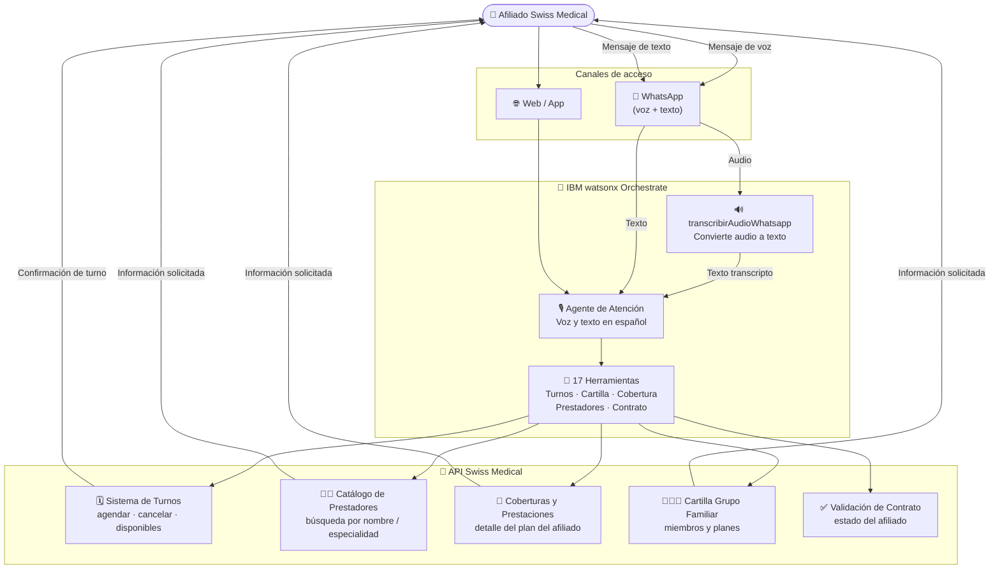

# Swiss Medical

  ✅ Activo
  🏥 Salud
  🤖 IBM watsonx Orchestrate
  🇦🇷 Argentina

## Descripción del caso

**Swiss Medical Group** es una de las principales empresas de medicina prepaga de Argentina, con cientos de miles de afiliados que realizan consultas diarias sobre turnos, coberturas y prestadores.

El **problema**: el volumen de consultas al call center es alto, con tiempos de espera prolongados para gestiones que en su mayoría son simples — agendar un turno, consultar cobertura, buscar un prestador cercano. Los afiliados esperan la misma experiencia digital que obtienen en otros servicios: inmediata, disponible por WhatsApp y en lenguaje natural, incluso enviando mensajes de voz.

La **solución**: un agente conversacional de voz y texto en **IBM watsonx Orchestrate**, accesible por **WhatsApp**, con **17 herramientas** integradas que cubren la totalidad de las operaciones de autogestión del afiliado:

- Agenda y cancela turnos médicos
- Busca prestadores por nombre, especialidad o zona
- Consulta coberturas y prestaciones del plan
- Accede a la cartilla del grupo familiar
- Transcribe mensajes de voz de WhatsApp a texto automáticamente

---

## One-Pager

<a href="../../assets/onepagers/OnePager_SwissMedical.pptx" class="download-btn" download>
  📥 Descargar One-Pager (PowerPoint)
</a>

| Campo | Detalle |
|---|---|
| **Cliente** | Swiss Medical Group |
| **Industria** | Salud / Medicina Prepaga |
| **País** | Argentina |
| **Estado** | ✅ Activo |
| **Productos IBM** | IBM watsonx Orchestrate |
| **Contacto CE** | Ignacio Ayerbe · Martina Pérez |

### El problema
Los afiliados de Swiss Medical dependen del call center para gestiones de autogestión — turnos, coberturas, prestadores — que generan altos volúmenes de llamadas y tiempos de espera. El canal de WhatsApp, donde los afiliados ya están, no estaba aprovechado para autogestión real.

### La solución IBM
Un agente conversacional en watsonx Orchestrate integrado en **WhatsApp**, con capacidad de procesar mensajes de texto y de voz. Respaldado por 17 herramientas especializadas que cubren turnos, prestadores, coberturas, cartilla familiar y validación del contrato del afiliado.

### Valor de negocio

- ✅ **Autogestión completa por WhatsApp** — turnos, coberturas, prestadores, cartilla familiar
- ✅ **Atención por voz** — los mensajes de audio se transcriben automáticamente con `transcribirAudioWhatsapp`
- ✅ **17 herramientas** cubren el 100% de las operaciones de autogestión del afiliado
- ✅ **Escalabilidad sin límite** de agentes humanos para picos de demanda

---

## Arquitectura de la solución

| Componente | Tecnología | Rol |
|---|---|---|
| Agente de Atención | IBM watsonx Orchestrate | Agente conversacional de voz y texto para autogestión del afiliado |
| `transcribirAudioWhatsapp` | watsonx Orchestrate (tool) | Convierte mensajes de voz de WhatsApp a texto para procesamiento |
| 16 herramientas de negocio | watsonx Orchestrate (tools) | Turnos, cartilla, coberturas, prestadores, servicios, validación |
| API Swiss Medical | Integración REST | Backend de afiliados, turnos y catálogo médico |

---

??? note "🔧 Guía técnica para engineers"

    **Stack:** IBM watsonx Orchestrate · WhatsApp Business API · 17 tools REST

    La solución incluye **17 herramientas** como YAMLs/JSON listos para importar en Orchestrate:

    `agendarTurno`, `buscarPrestadorPorNombre`, `buscarPrestadoresCartilla`, `cancelarTurno`, `getCartillaGrupoFamiliar`, `getCentrosPropios`, `getCoberturasPrestacionesPrestador`, `getEspecialidadesTurnos`, `getPrestaciones`, `getServicios`, `getSubespecialidades`, `getTotalizadores`, `getTurnosDisponibles`, `getTurnosProgramados`, `transcribirAudioWhatsapp`, `validarContrato`, `emitConversationEnvelope`

    También se incluyen **dos variantes del agente**: versión optimizada y versión con voz v2.

    → Guía técnica completa: `pilotos/swiss-medical/guia-tecnica.md`
