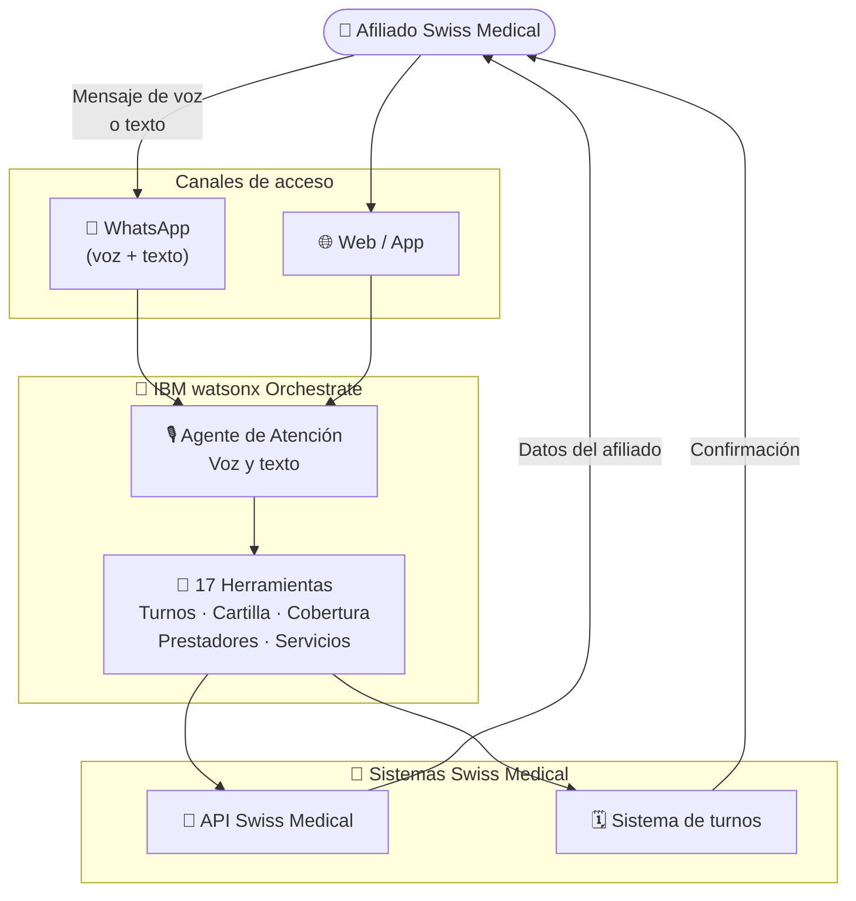

# Swiss Medical

  ✅ Activo
  🏥 Salud
  🤖 IBM watsonx Orchestrate
  🇦🇷 Argentina

## Descripción del caso

**Swiss Medical** es una de las principales empresas de medicina prepaga de Argentina, con cientos de miles de afiliados que realizan consultas diarias sobre turnos, coberturas y prestadores.

El **problema**: el volumen de consultas al call center es alto, con tiempos de espera prolongados para gestiones que en su mayoría son simples (agendar un turno, consultar cobertura, buscar un prestador). Los afiliados esperan la misma experiencia digital que obtienen en otros servicios — inmediata, disponible por WhatsApp y en lenguaje natural.

La **solución**: un agente conversacional de voz y texto en IBM watsonx Orchestrate, accesible por WhatsApp, con **17 herramientas** integradas que cubren la totalidad de las operaciones de autogestión del afiliado. El agente entiende mensajes de voz (transcripción automática), procesa la solicitud y responde en lenguaje natural con datos en tiempo real de los sistemas de Swiss Medical.

---

## One-Pager

| Campo | Detalle |
|---|---|
| **Cliente** | Swiss Medical Group |
| **Industria** | Salud / Medicina Prepaga |
| **País** | Argentina |
| **Estado** | ✅ Activo |
| **Productos IBM** | IBM watsonx Orchestrate |
| **Contacto CE** | Ignacio Ayerbe · Martina Pérez |

### El problema
Los afiliados de Swiss Medical dependen del call center para gestiones de autogestión (turnos, coberturas, prestadores) que generan altos volúmenes y tiempos de espera. El canal de WhatsApp no está aprovechado para autogestión real.

### La solución IBM
Un agente conversacional en watsonx Orchestrate con capacidad de voz integrado en WhatsApp, respaldado por 17 herramientas especializadas que cubren turnos, prestadores, coberturas, cartilla familiar y más.

### Valor de negocio

- ✅ **Autogestión completa** por WhatsApp — turnos, coberturas, prestadores, cartilla familiar
- ✅ **Atención por voz** — los mensajes de audio se transcriben automáticamente
- ✅ **Escalabilidad sin límite** de agentes humanos para picos de demanda

---

## Arquitectura de la solución

| Componente | Tecnología IBM | Rol |
|---|---|---|
| Agente de Atención | watsonx Orchestrate | Agente de voz y texto para gestión integral del afiliado |
| 17 Herramientas | watsonx Orchestrate (Tools) | Turnos, cartilla, coberturas, prestadores, servicios, transcripción |
| Transcripción de voz | watsonx Orchestrate | Convierte mensajes de voz de WhatsApp a texto |
| API Swiss Medical | Integración REST | Conecta con los sistemas del backend de la aseguradora |

---

??? note "🔧 Guía técnica para engineers"

    **Stack:** IBM watsonx Orchestrate · WhatsApp Business API · 17 tools REST

    La solución incluye **dos variantes del agente** (optimizado y voz v2) y **17 herramientas** como YAMLs de OpenAPI listos para importar en Orchestrate.

    **Herramientas incluidas (tools/):**
    `agendarTurno`, `buscarPrestadorPorNombre`, `buscarPrestadoresCartilla`, `cancelarTurno`, `getCartillaGrupoFamiliar`, `getCentrosPropios`, `getCoberturasPrestacionesPrestador`, `getEspecialidadesTurnos`, `getPrestaciones`, `getServicios`, `getSubespecialidades`, `getTotalizadores`, `getTurnosDisponibles`, `getTurnosProgramados`, `transcribirAudioWhatsapp`, `validarContrato`, `emitConversationEnvelope`

    → Ver guía técnica completa en [`guia-tecnica.md`](../../pilotos/swiss-medical/guia-tecnica.md)
