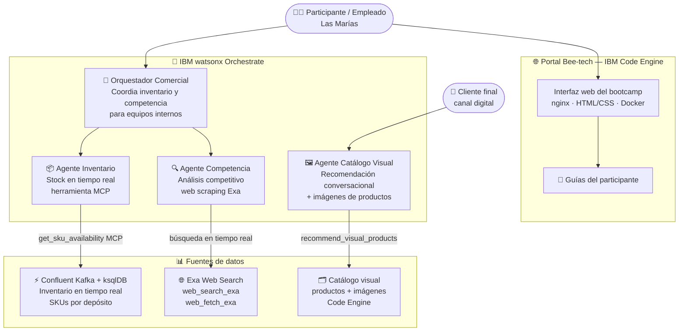

# Bee-tech wxO Bootcamp

<div class="asset-header">
<div class="asset-meta">
  <span class="badge badge-completed">✔️ Completado</span>
  <span>🎓 Bootcamp · Bee-tech 2026</span>
  <span>🤖 IBM watsonx Orchestrate</span>
  <span>🇦🇷 Argentina</span>
</div>
</div>

## Descripción del caso

El **Bee-tech wxO Bootcamp** es un evento de capacitación en IA Agéntica realizado para la empresa "**Las Marías**"  (fabricante de yerba mate Taragüí, Unión y La Merced) simulado para realizar los laboratorios, donde los participantes construyen un **sistema multiagente real** con IBM watsonx Orchestrate usando datos operacionales de la empresa.

Los participantes construyen 4 agentes de punta a punta: un agente de inventario en tiempo real conectado a Confluent Kafka vía MCP, un agente de análisis competitivo con web scraping, un agente catálogo visual con recomendación conversacional, y un orquestador comercial que coordina los tres anteriores. Todo accesible desde un **portal web propio** deployado en IBM Code Engine.

---

## One-Pager

<a href="#" class="download-btn" style="opacity:0.5;cursor:not-allowed;" title="Próximamente">
  📎 One-Pager — próximamente disponible
</a>

| Campo | Detalle |
|---|---|
| **Cliente / Contexto** | Las Marías — Bee-tech 2026 |
| **Industria** | Consumo masivo / Food & Beverage |
| **País** | Argentina |
| **Estado** | ✔️ Completado |
| **Productos IBM** | IBM watsonx Orchestrate · IBM Code Engine · IBM Container Registry |
| **Contacto CE** | Ignacio Ayerbe · Martina Pérez |

### El caso de uso del bootcamp
Los participantes construyen un sistema multiagente para Las Marías con 4 agentes especializados en watsonx Orchestrate: disponibilidad de inventario en tiempo real (Confluent Kafka + MCP), análisis competitivo de yerba mate (web scraping con Exa), recomendación visual de productos (RAG conversacional), y un orquestador comercial que coordina los tres. El sistema asiste tanto a equipos internos como a canales digitales de venta.

### Los 4 agentes construidos

| Agente | Rol | Tecnología |
|---|---|---|
| **Agente Inventario** | Consulta stock en tiempo real por SKU y depósito | Herramienta MCP → Confluent Kafka + ksqlDB |
| **Agente Competencia** | Analiza competidores de yerba mate con datos de la web | Web scraping en tiempo real con Exa (web_search_exa + web_fetch_exa) |
| **Agente Catálogo Visual** | Recomienda productos a clientes finales con imágenes | Proceso conversacional + tool `recommend_visual_products` |
| **Orquestador Comercial** | Coordina los agentes de inventario y competencia para equipos internos | watsonx Orchestrate multi-agent con lógica de orquestación |

### Valor del workshop

- ✅ **Sistema multiagente real** — 4 agentes con roles diferenciados, no demos genéricas
- ✅ **Inventario en tiempo real** — herramienta MCP conectada a Confluent Kafka y ksqlDB
- ✅ **Análisis competitivo con web scraping** — Exa busca y extrae datos reales de competidores
- ✅ **Catálogo visual conversacional** — el agente pregunta preferencias y devuelve producto + imagen
- ✅ **Portal propio del evento** deployado en IBM Code Engine con identidad Las Marías

---

## Arquitectura de la solución



| Componente | Tecnología | Rol |
|---|---|---|
| Orquestador Comercial | watsonx Orchestrate (multi-agent) | Coordina Agente Inventario y Agente Competencia para empleados internos |
| Agente Inventario | watsonx Orchestrate + MCP | Consulta SKUs y stock por depósito desde Confluent Kafka vía ksqlDB |
| Agente Competencia | watsonx Orchestrate + Exa | Analiza competidores de yerba mate con web scraping en tiempo real |
| Agente Catálogo Visual | watsonx Orchestrate + tool REST | Recomienda productos con imágenes mediante proceso conversacional |
| Portal del evento | IBM Code Engine + nginx + Docker | Sirve las guías y materiales del bootcamp |
| IBM Container Registry | IBM Cloud (ICR) | Almacena la imagen Docker del portal |

---

??? note "🔧 Guía técnica para engineers"

    **Stack:** IBM watsonx Orchestrate · ADK (Agent Development Kit) · Confluent Kafka · ksqlDB · MCP · Exa API · Python · Docker · nginx · IBM Code Engine

    **Herramientas usadas:**

    - `get_sku_availability` — herramienta MCP que consulta disponibilidad de productos por SKU y depósito en ksqlDB sobre Confluent Kafka
    - `recommend_visual_products` — tool REST que devuelve producto + imagen según preferencias del usuario (intensidad, con/sin palo, experiencia)
    - `web_search_exa` + `web_fetch_exa` — tools MCP de Exa para web scraping en tiempo real de competidores

    **Agentes (YAMLs listos para importar con el ADK):**

    ```
    Agentes-de-IA-para-Las-Marías/assets/
    ├── Agente_Inventario.yaml         # LLM: gpt-oss-120b · tool: get_sku_availability (MCP)
    ├── Agente_Competencia.yaml        # LLM: gpt-oss-120b · tools: web_search_exa, web_fetch_exa
    ├── Agente_Catalogo_Visual.yaml    # LLM: gpt-oss-120b · tool: recommend_visual_products
    ├── Orquestador_Comercial.yaml     # LLM: gpt-oss-120b · collaborators: Inventario + Competencia
    ├── get_sku_availability.py        # Servidor MCP de inventario
    └── visual_product_tool.py         # Tool REST catálogo visual
    ```

    **Portal del bootcamp:**

    ```bash
    # Levantar localmente
    cd "[Workshop] Bee-tech wxO/Interfaz_Beetech"
    docker compose up --build
    # Portal en http://localhost:8081

    # Deploy en IBM Code Engine
    podman build --platform linux/amd64 -t us.icr.io/ce-latam/beetech-portal:latest .
    podman push us.icr.io/ce-latam/beetech-portal:latest
    ibmcloud ce app update --name beetech-labs-app --image us.icr.io/ce-latam/beetech-portal:latest
    ```

    **URL del portal:** [beetech-labs-app.2b6jhfm91b2v.us-south.codeengine.appdomain.cloud](https://beetech-labs-app.2b6jhfm91b2v.us-south.codeengine.appdomain.cloud/)
