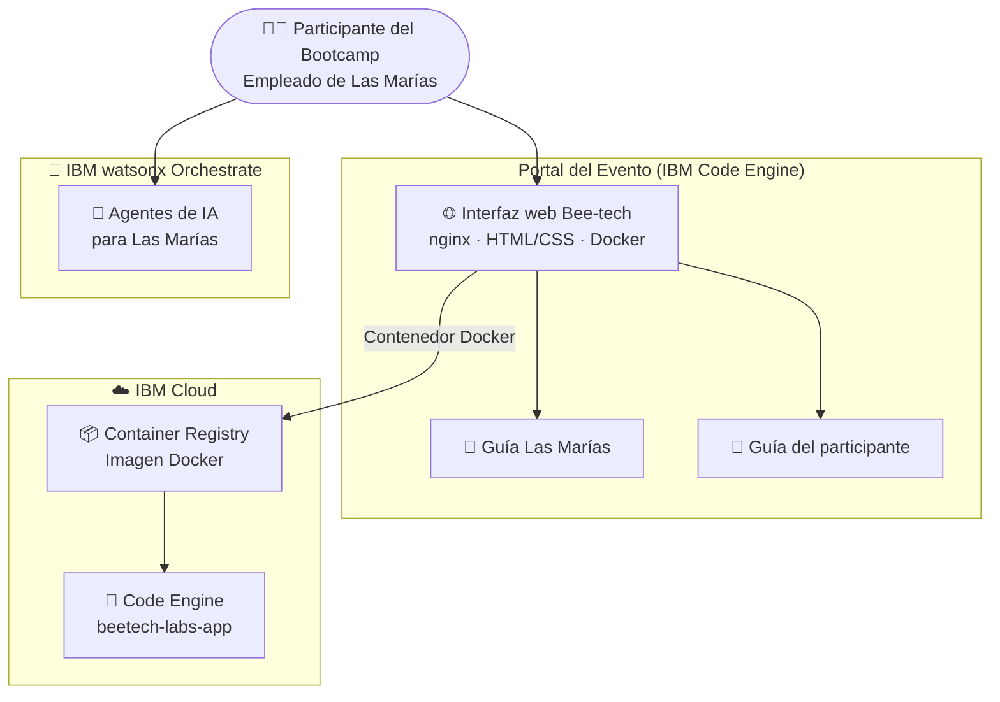

# Bee-tech wxO Bootcamp

<div class="asset-header">
<div class="asset-meta">
  <span class="badge badge-completed">✔️ Completado</span>
  <span>🎓 Bootcamp · Bee-tech 2026</span>
  <span>🤖 IBM watsonx Orchestrate</span>
  <span>🇦🇷 Argentina</span>
</div>
</div>

## Descripción del caso

El **Bee-tech wxO Bootcamp** es un evento de capacitación en Inteligencia Artificial Agéntica realizado para la empresa **Las Marías** (fabricante de yerba mate Taragüí), donde los participantes construyen agentes de IA con IBM watsonx Orchestrate en un contexto de negocio real.

El workshop se despliega con un **portal web propio** (HTML/CSS servido con nginx en IBM Code Engine) que centraliza las guías del participante, el material del bootcamp y el acceso a los agentes — creando una experiencia profesional y autónoma para el evento.

---

## One-Pager

| Campo | Detalle |
|---|---|
| **Cliente / Contexto** | Las Marías — Bee-tech 2026 |
| **Industria** | Consumo masivo / Food & Beverage |
| **País** | Argentina |
| **Estado** | ✔️ Completado |
| **Productos IBM** | IBM watsonx Orchestrate · IBM Code Engine |
| **Contacto CE** | Ignacio Ayerbe · Martina Pérez |

### El caso de uso del bootcamp
Construir agentes de IA para casos de uso de Las Marías con IBM watsonx Orchestrate, accedidos desde un portal web deployado en IBM Code Engine durante el evento.

### Valor del workshop

- ✅ **Portal propio del evento** con identidad visual de Las Marías deployado en IBM Cloud
- ✅ **Experiencia autónoma** — los participantes tienen guías, materiales y acceso a agentes en un solo lugar
- ✅ **Replicable** — el portal se puede reusar para cualquier bootcamp futuro cambiando el contenido

---

## Arquitectura de la solución



| Componente | Tecnología IBM | Rol |
|---|---|---|
| Portal del evento | IBM Code Engine + nginx | Sirve la interfaz web del bootcamp |
| Agentes de Las Marías | IBM watsonx Orchestrate | Casos de uso de IA para el negocio |
| Container Registry | IBM Cloud (ICR) | Almacena la imagen Docker del portal |

---

??? note "🔧 Guía técnica para engineers"

    **Stack:** HTML/CSS estático · Docker · nginx · IBM Code Engine · IBM Container Registry

    **URL del portal:** [beetech-labs-app.2b6jhfm91b2v.us-south.codeengine.appdomain.cloud](https://beetech-labs-app.2b6jhfm91b2v.us-south.codeengine.appdomain.cloud/)

    **Levantar localmente:**
    ```bash
    cd workshops/bee-tech-wxo/Interfaz_Beetech
    docker compose up --build
    # Portal en http://localhost:8081
    ```

    **Deploy en IBM Code Engine:**
    ```bash
    cp deploy.sh.example deploy.sh
    export IBMCLOUD_APIKEY="tu_api_key"
    ./deploy.sh
    ```

    → Ver `README-DEPLOY.md` para instrucciones completas de deployment
