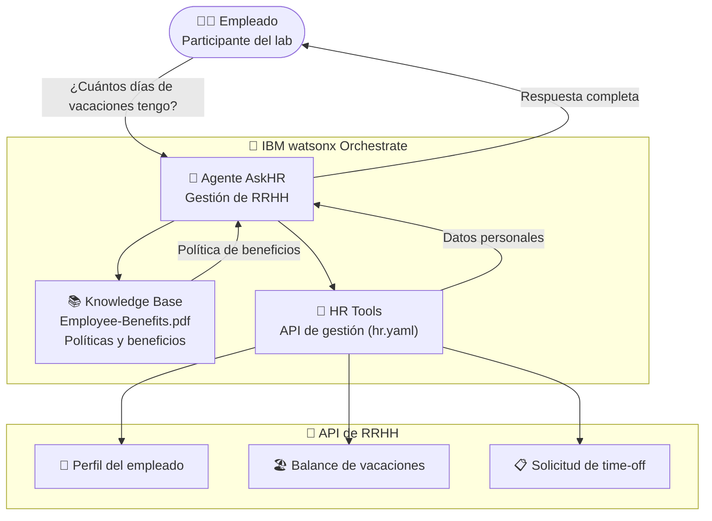

# Bootcamp askHR — BCI

  ✔️ Completado
  🎓 Bootcamp · BCI
  🤖 IBM watsonx Orchestrate
  🌎 LATAM

## Descripción del caso

El **Bootcamp Agentic AskHR** es un laboratorio hands-on diseñado para que equipos de ingeniería de clientes IBM (en este caso BCI — Banco de Crédito e Inversiones) aprendan a construir agentes de IA desde cero con IBM watsonx Orchestrate.

El **caso de uso del lab**: construir un agente de RRHH que permite a los empleados consultar sus beneficios, gestionar solicitudes de vacaciones y actualizar información de perfil — todo en lenguaje natural, sin formularios ni navegación por sistemas de RRHH.

El workshop incluye el agente completo, los datos (PDF de beneficios, especificación OpenAPI de la API HR, usuarios de prueba) y la guía paso a paso para construirlo desde cero.

---

## One-Pager

| Campo | Detalle |
|---|---|
| **Contexto** | Bootcamp Agentic — BCI (Banco de Crédito e Inversiones) |
| **Formato** | Hands-on lab — construcción desde cero |
| **Duración** | Medio día |
| **Estado** | ✔️ Completado |
| **Productos IBM** | IBM watsonx Orchestrate |
| **Contacto CE** | Ignacio Ayerbe · Martina Pérez |

### El caso de uso del lab
Construir un agente AskHR que responde preguntas de empleados sobre beneficios y permite gestionar solicitudes de time-off usando IBM watsonx Orchestrate con knowledge base y herramientas.

### Valor del workshop

- ✅ **Aprende haciendo** — el participante sale con un agente funcional propio
- ✅ **Caso de uso real** — AskHR es aplicable a cualquier empresa con RRHH
- ✅ **Cubre los tres pilares**: knowledge base, tools (API) y agente conversacional

---

## Arquitectura de la solución

| Componente | Tecnología IBM | Rol |
|---|---|---|
| Agente AskHR | watsonx Orchestrate | Agente conversacional de RRHH |
| Knowledge Base | watsonx Orchestrate (KB) | Políticas de beneficios (PDF) |
| HR Tools | watsonx Orchestrate (Tools) | Conexión con API HR vía OpenAPI |
| API HR | OpenAPI (hr.yaml) | Perfiles, vacaciones, solicitudes |

---

??? note "🔧 Guía técnica para engineers"

    **Stack:** IBM watsonx Orchestrate · OpenAPI (hr.yaml) · PDF knowledge base

    **Materiales del lab:**

    - `Employee-Benefits.pdf` — documento de beneficios para la knowledge base
    - `hr.yaml` — especificación OpenAPI de la API HR (importable como toolset en Orchestrate)
    - `users_data.xlsx` — usuarios de prueba para validar el agente
    - `hands-on-lab-askHR.md` — guía paso a paso completa del laboratorio
    - `general-questions.md` — ejemplos de preguntas para testear el agente

    → Ver guía completa del lab en [`hands-on-lab-askHR.md`](https://github.com/ibm-ce-latam/ce-latam-ai-portfolio/blob/main/workshops/bootcamp-askhr-bci/hands-on-lab-askHR.md)
