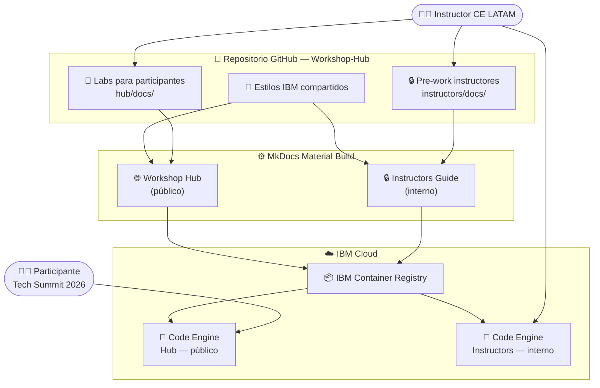

# Tech Summit Labs 2026

<div class="asset-header">
<div class="asset-meta">
  <span class="badge badge-completed">✔️ Completado</span>
  <span>🏆 Tech Summit Argentina 2026</span>
  <span>🤖 IBM Bob · watsonx</span>
  <span>🇦🇷 Argentina</span>
</div>
</div>

## Descripción del caso

El **Tech Summit Labs 2026** es el conjunto de laboratorios hands-on del Tech Summit Argentina 2026, el evento técnico más importante de IBM en la región. Los labs cubren IBM Bob (modernización de código RPGLE, Java), watsonx Orchestrate y watsonx.ai.

La infraestructura del workshop se basa en un **Workshop Hub** — un portal MkDocs Material con dos sitios diferenciados: uno público para los participantes y uno interno para los instructores — deployados de forma independiente en IBM Code Engine.

---

## One-Pager

| Campo | Detalle |
|---|---|
| **Evento** | Tech Summit Argentina 2026 |
| **Audiencia** | Clientes, partners técnicos e ingenieros IBM |
| **Estado** | ✔️ Completado |
| **Productos IBM** | IBM Bob · IBM watsonx Orchestrate · IBM watsonx.ai · IBM Code Engine |
| **Contacto CE** | Ignacio Ayerbe · Martina Pérez |

### El caso de uso
Proveer una experiencia de laboratorio hands-on de alta calidad para el Tech Summit 2026, con navegación unificada, identidad visual IBM, y separación clara entre contenido para participantes y pre-work para instructores.

### Valor del workshop

- ✅ **Un repo, dos sitios** — Hub público e Instructors Guide interno con deployment independiente
- ✅ **Reusable** — nueva taxonomía de labs (Solución → Grupo → Lab N) lista para futuros eventos
- ✅ **IBM Brand** — identidad visual IBM consistente con colores por solución

---

## Arquitectura de la solución



| Componente | Tecnología IBM | Rol |
|---|---|---|
| Workshop Hub | MkDocs Material + IBM Code Engine | Portal público con los labs para participantes |
| Instructors Guide | MkDocs Material + IBM Code Engine | Portal interno con pre-work para instructores |
| IBM Container Registry | IBM Cloud (ICR) | Imágenes Docker de ambos sitios |
| Estilos IBM Brand | CSS custom | Paleta IBM y colores por solución |

---

??? note "🔧 Guía técnica para engineers"

    **Stack:** MkDocs 1.6 · Material for MkDocs 9.5 · Python · Docker · nginx · IBM Code Engine

    **Levantar localmente:**
    ```bash
    pip install -r requirements.txt

    # Hub (participantes)
    mkdocs serve -f hub/mkdocs.yml -a localhost:8001

    # Instructors Guide (instructor)
    mkdocs serve -f instructors/mkdocs.yml -a localhost:8002
    ```

    **Agregar un nuevo lab:**

    1. Crear `hub/docs/<solución>/<grupo>/lab-NN-nombre/index.md`
    2. Linkear desde `hub/docs/<solución>/<grupo>/index.md`
    3. Crear el pre-work en `instructors/docs/<mismo-path>/index.md`

    → Ver `README.md` completo del Workshop-Hub para convenciones de contenido y deployment
