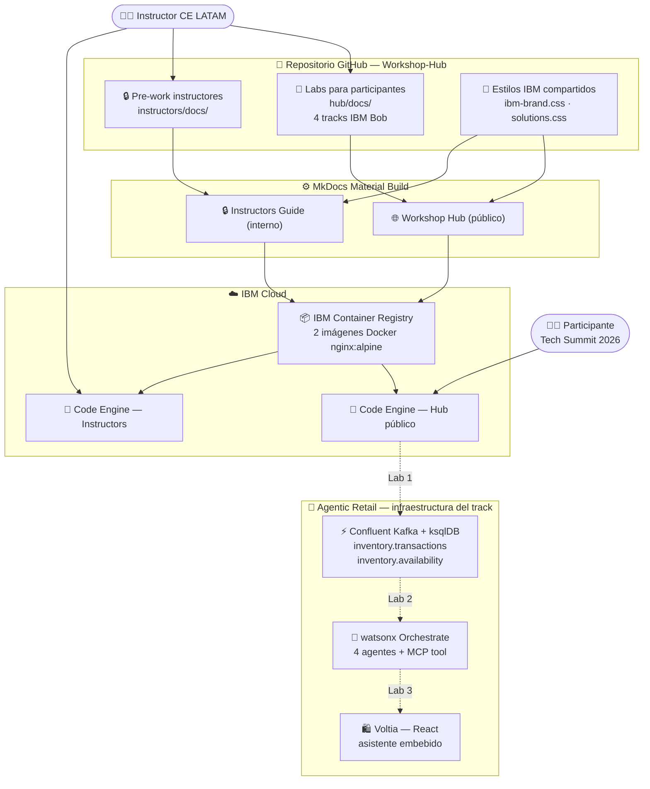

# Tech Summit Labs 2026

<div class="asset-header">
<div class="asset-meta">
  <span class="badge badge-completed">✔️ Completado</span>
  <span>🏆 Tech Summit Argentina 2026</span>
  <span>🤖 IBM Bob · Confluent · watsonx Orchestrate</span>
  <span>🇦🇷 Argentina</span>
</div>
</div>

## Descripción del caso

El **Tech Summit Labs 2026** es el conjunto de laboratorios hands-on del Tech Summit Argentina 2026, el evento técnico más grande de IBM en la región. El workshop se centra en **IBM Bob** con 4 tracks de laboratorios disponibles, más watsonx Orchestrate y watsonx.ai como tracks planificados.

La infraestructura se basa en un **Workshop Hub** — dos sitios MkDocs Material independientes (Hub público para participantes e Instructors Guide interno) deployados en IBM Code Engine.

---

## One-Pager

<a href="#" class="download-btn" style="opacity:0.5;cursor:not-allowed;" title="Próximamente">
  📎 One-Pager — próximamente disponible
</a>

| Campo | Detalle |
|---|---|
| **Evento** | Tech Summit Argentina 2026 |
| **Audiencia** | Clientes, partners técnicos e ingenieros IBM |
| **Estado** | ✔️ Completado |
| **Productos IBM** | IBM Bob · IBM watsonx Orchestrate · Confluent Kafka · IBM Code Engine |
| **Contacto CE** | Ignacio Ayerbe · Martina Pérez |

### Los 4 tracks de IBM Bob

=== "🛍️ Agentic Retail — Voltia (track estrella)"

    Tres labs secuenciales en español que construyen **Voltia**, una tienda de electrónica con inventario en tiempo real e IA agéntica:

    | Lab | Qué se construye | Tecnología |
    |---|---|---|
    | **Lab 1** | Pipeline de inventario en tiempo real: tópicos Kafka `inventory.transactions` + tabla ksqlDB `inventory.availability` por SKU y sucursal | Confluent Kafka + ksqlDB |
    | **Lab 2** | 4 agentes en watsonx Orchestrate: SKU Availability (MCP→Kafka), Substitute Finder (RAG sobre catálogo), Store Associate (supervisor), Customer Shopping Assistant + snippet para embeber | IBM watsonx Orchestrate + ADK |
    | **Lab 3** | Tienda React Voltia construida con IBM Bob desde mockups (storefront, producto, reserva) con el asistente del Lab 2 embebido y animaciones Framer Motion | IBM Bob + React + Framer Motion |

=== "🏭 Java Modernization — Simple Pharmacy"

    6 labs que migran una app farmacia de **WebSphere + Java 8 + Struts** a **Liberty + Java 21 + Angular**:

    | Lab | Qué hace |
    |---|---|
    | **Lab 1** | Replatforming WebSphere → Liberty con AMA migration plans |
    | **Lab 2** | Upgrade Java 8 → Java 21 con recipes de Bob |
    | **Lab 3** | UI Struts → Angular 19 SPA con REST backend |
    | **Lab 4** | Generación de suite JUnit 5 + Mockito + JaCoCo (>80% coverage) |
    | **Lab Alt-4** | TDD desde OpenAPI 3.0: Red-Green-Refactor con Bob |
    | **Lab 5** | Remediación de 6 vulnerabilidades de seguridad intencionales |

=== "🖥️ IBM i & RPG Development — SAMCO"

    6 labs que modernizan **SAMCO**, un sistema de gestión de pedidos con pantalla verde y RPG legacy:

    | Lab | Qué hace |
    |---|---|
    | **Lab 0** | Descubrir SAMCO: business rules, RPG legacy, flujo de pedidos |
    | **Lab 1** | Convertir RPG Fixed format → Free format con `Dcl-Proc` |
    | **Lab 2** | Construir UI React + Carbon Design System moderna |
    | **Lab 3** | Reemplazar acceso RLA por SQL embebido con JOINs |
    | **Lab 4** *(opt.)* | Conectar Bob a IBM i vía MCP: queries en lenguaje natural sobre el sistema |
    | **Lab 5** *(opt.)* | Generar playbooks Ansible para gestión de PTFs con Bob |

=== "☕ Software Development Lifecycle — Bob's Beans"

    7 labs que construyen **Bob's Beans**, una tienda de café, desde mockups hasta documentación:

    | Lab | Qué hace |
    |---|---|
    | **Lab 01** | Planificación: mockups + API → task list con Bob en modo Plan |
    | **Lab 02** | Storefront: grilla de productos filtrada por categoría desde REST |
    | **Lab 03** | Product detail: routing dinámico, quantity stepper, add-to-cart |
    | **Lab 04** | Cart & checkout: order summary + `createOrder()` + confirmación |
    | **Lab 05** | Animaciones con Framer Motion: grid, toast, badge, checkout |
    | **Lab 06** | Review visual contra mockups: responsiveness y estados vacíos |
    | **Lab 07** | Documentación: site MkDocs Material generado por Bob |

### Valor del workshop

- ✅ **Agentic Retail end-to-end** — Confluent Kafka → 4 agentes wxO (MCP + RAG) → tienda React con asistente embebido
- ✅ **Java Modernization completa** — WebSphere+Java8+Struts → Liberty+Java21+Angular, tests y seguridad
- ✅ **IBM i & RPG moderno** — de pantalla verde y código Fixed a React+Carbon + MCP + Ansible
- ✅ **SDLC con Bob** — 7 labs desde plan hasta docs, con app real funcionando
- ✅ **Un repo, dos sitios** — Hub público e Instructors Guide interno deployados independientemente en Code Engine

---

## Arquitectura de la solución



| Componente | Tecnología | Rol |
|---|---|---|
| Workshop Hub | MkDocs Material + IBM Code Engine | Portal público con los 4 tracks de IBM Bob |
| Instructors Guide | MkDocs Material + IBM Code Engine | Portal interno con pre-work, timing y gotchas |
| IBM Container Registry | IBM Cloud (ICR) | 2 imágenes Docker nginx:alpine (Hub + Instructors) |
| Confluent Kafka + ksqlDB | Confluent Cloud | Inventario en tiempo real — Agentic Retail Lab 1 |
| watsonx Orchestrate (4 agentes) | IBM watsonx Orchestrate + ADK | SKU Availability (MCP) · Substitute Finder (RAG) · Store Associate · Shopping Assistant — Lab 2 |
| Voltia | IBM Bob + React + Framer Motion | Tienda web con asistente wxO embebido — Lab 3 |
| SAMCO | RPG legacy + Bob | Aplicación de referencia para el track IBM i & RPG |
| Simple Pharmacy | Java + Liberty + Bob | Aplicación de referencia para el track Java Modernization |
| Bob's Beans | React + Vite + Tailwind + Bob | Aplicación de referencia para el track SDLC |

---

??? note "🔧 Guía técnica para engineers"

    **Stack:** MkDocs Material 9.5 · Python · Docker · nginx:alpine · IBM Code Engine · IBM Container Registry · GitHub Actions (CI/CD)

    **Estructura del repositorio:**
    ```
    Workshop-Hub/
    ├── hub/docs/
    │   ├── ibm-bob/
    │   │   ├── agentic-retail/         # Track Voltia (3 labs) — Confluent + wxO + React
    │   │   ├── java-modernization/     # Track Simple Pharmacy (6 labs) — WebSphere → Liberty
    │   │   ├── ibm-i-rpg-development/  # Track SAMCO (6 labs) — RPG Fixed → Free + MCP
    │   │   └── software-development-lifecycle/ # Track Bob's Beans (7 labs) — SDLC completo
    │   ├── watsonx-orchestrate/        # Planificado (coming soon)
    │   └── watsonx-ai/                 # Planificado (coming soon)
    └── instructors/docs/               # Pre-work, timing y gotchas por track
    ```

    **Levantar localmente:**
    ```bash
    pip install -r requirements.txt

    # Hub público (participantes)
    mkdocs serve -f mkdocs.yml -a localhost:8000

    # Instructors Guide (interno)
    mkdocs serve -f mkdocs-instructors.yml -a localhost:8001
    ```

    **Deploy en IBM Code Engine (manual):**
    ```bash
    # Hub
    podman build --platform linux/amd64 -f deploy/Dockerfile.hub \
      -t us.icr.io/ce-latam/tech-summit-hub:latest .
    podman push us.icr.io/ce-latam/tech-summit-hub:latest
    ibmcloud ce app update --name tech-summit-hub \
      --image us.icr.io/ce-latam/tech-summit-hub:latest

    # Instructors
    podman build --platform linux/amd64 -f deploy/Dockerfile.instructors \
      -t us.icr.io/ce-latam/tech-summit-instructors:latest .
    podman push us.icr.io/ce-latam/tech-summit-instructors:latest
    ibmcloud ce app update --name tech-summit-instructors \
      --image us.icr.io/ce-latam/tech-summit-instructors:latest
    ```

    **Cada push a `main` dispara el GitHub Actions workflow** que buildea ambas imágenes y actualiza ambas apps en Code Engine automáticamente.
