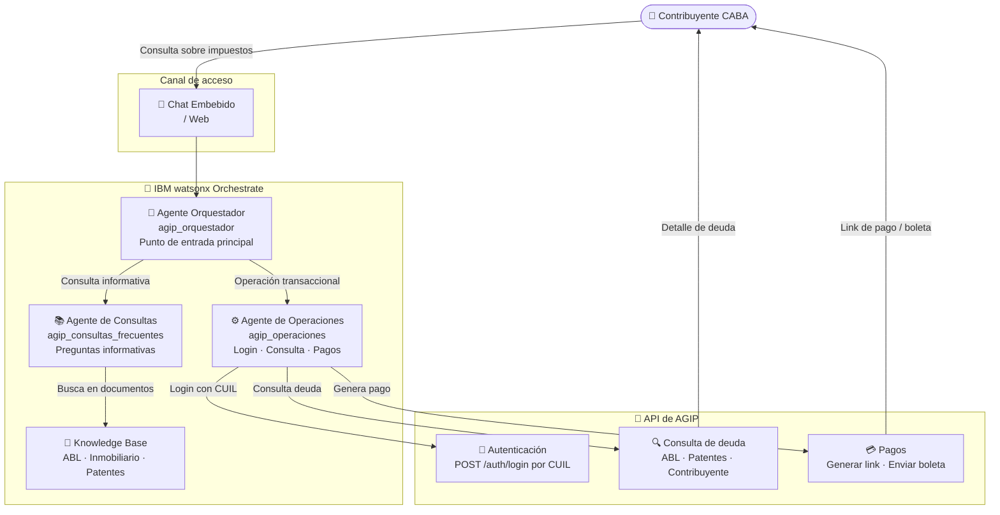

# AGIP — Arquitectura de la Solución

## Diagrama de arquitectura

---

## Componentes clave

| Componente | Tecnología IBM | Rol en la solución |
|---|---|---|
| Agente Orquestador | IBM watsonx Orchestrate | Punto de entrada único, detecta la intención y delega al agente correcto |
| Agente de Operaciones | IBM watsonx Orchestrate | Ejecuta el flujo transaccional: login, consulta de deuda y generación de pagos |
| Agente de Consultas Frecuentes | IBM watsonx Orchestrate | Responde preguntas informativas sobre impuestos, vencimientos y trámites |
| Knowledge Base | IBM watsonx Orchestrate (KB) | Documentos de referencia: Inmobiliario/ABL, Patentes Automotores |
| API AGIP | Node.js en IBM Code Engine | Mock de la API de AGIP con endpoints de autenticación, consulta y pagos |

---

## Flujo de datos

1. El **contribuyente** inicia una conversación desde el canal web o chat embebido
2. El **agente orquestador** recibe el mensaje, identifica la intención y delega: consultas informativas al agente de FAQ, operaciones al agente de operaciones
3. Para operaciones: el contribuyente se autentica con su **CUIL**, el agente consulta la deuda (ABL, patentes) llamando a la API de AGIP
4. El agente genera un **link de pago o boleta** y lo envía al contribuyente
5. Todas las preguntas informativas son respondidas usando los documentos de la **knowledge base**
