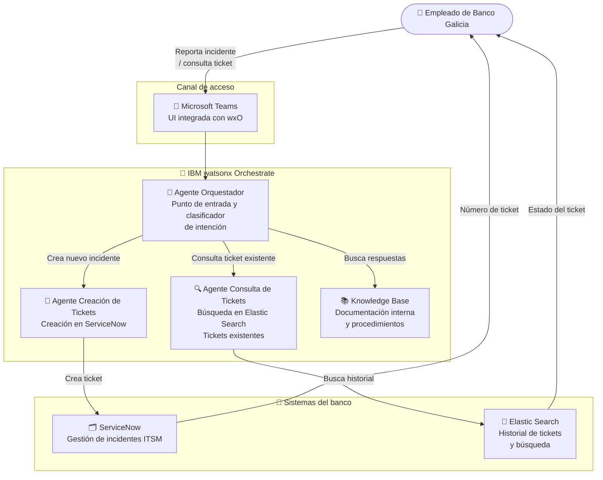

# Galicia — Arquitectura de la Solución

## Diagrama de arquitectura

---

## Componentes clave

| Componente | Tecnología IBM | Rol en la solución |
|---|---|---|
| Agente Orquestador | IBM watsonx Orchestrate | Clasifica la intención del empleado y delega al agente correcto |
| Agente Consulta de Tickets | IBM watsonx Orchestrate | Busca el estado de tickets existentes vía Elastic Search |
| Agente Creación de Tickets | IBM watsonx Orchestrate | Crea nuevos incidentes en ServiceNow con los datos del empleado |
| Knowledge Base | IBM watsonx Orchestrate (KB) | Documentación interna y procedimientos de soporte IT |
| Canal Teams | Microsoft Teams | Interfaz conversacional integrada con watsonx Orchestrate |

---

## Flujo de datos

1. El **empleado** reporta un incidente o consulta el estado de un ticket desde **Microsoft Teams**
2. El **agente orquestador** recibe el mensaje y clasifica la intención: ¿es una consulta de estado o un nuevo incidente?
3. Para **consultas**: el agente de Elastic Search busca en el historial y devuelve el estado del ticket
4. Para **nuevos incidentes**: el agente recopila los datos del problema, llama a la herramienta `create_incident` y crea el ticket en **ServiceNow**
5. El empleado recibe el número de ticket o el estado directamente en el chat de Teams
