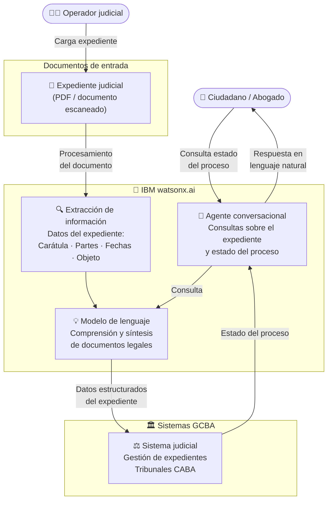

# GCBA Tribunales — Arquitectura de la Solución

## Diagrama de arquitectura

---

## Componentes clave

| Componente | Tecnología IBM | Rol en la solución |
|---|---|---|
| Extracción de información | IBM watsonx.ai | Procesa documentos judiciales (PDFs) y extrae datos estructurados: carátula, partes, fechas, objeto del proceso |
| Agente conversacional | IBM watsonx.ai | Responde consultas sobre el estado del expediente en lenguaje natural |
| Modelo de lenguaje | IBM watsonx.ai (Llama / Granite) | Comprende y sintetiza documentos legales en español |
| Sistema judicial GCBA | Sistema legado GCBA | Repositorio central de expedientes de los Tribunales de la Ciudad |

---

## Flujo de datos

1. El **operador judicial** carga un expediente (PDF o documento escaneado) en el sistema
2. El modelo de **watsonx.ai** procesa el documento, extrae la información relevante (carátula, partes intervinientes, objeto del proceso, fechas clave) y la estructura
3. Los datos estructurados se registran en el **sistema judicial del GCBA**
4. El **ciudadano o abogado** puede consultar el estado de su expediente a través del **agente conversacional**
5. El agente responde en lenguaje natural, sin necesidad de navegar por sistemas complejos
