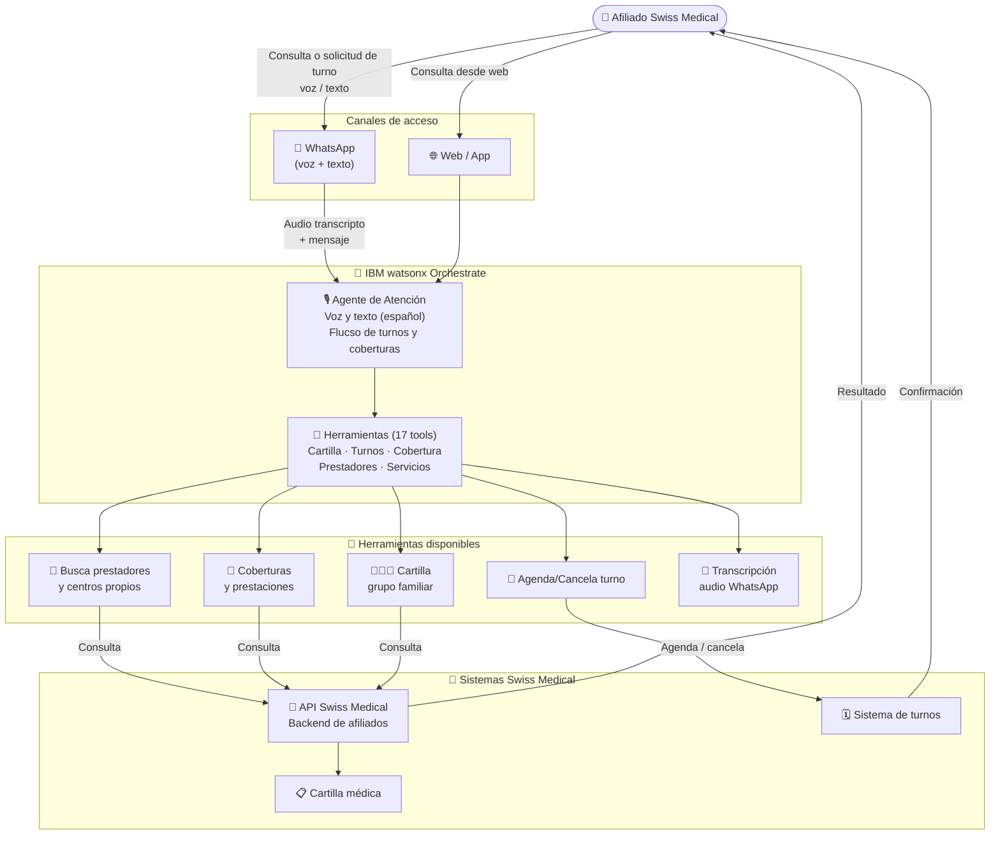

# Swiss Medical — Arquitectura de la Solución

## Diagrama de arquitectura

---

## Componentes clave

| Componente | Tecnología IBM | Rol en la solución |
|---|---|---|
| Agente de Atención | IBM watsonx Orchestrate | Agente conversacional de voz y texto para gestión completa del afiliado |
| 17 Herramientas (tools) | IBM watsonx Orchestrate (Tools) | Cobertura funcional completa: turnos, prestadores, cartilla, coberturas, servicios |
| Transcripción de audio | IBM watsonx Orchestrate | Convierte mensajes de voz de WhatsApp a texto para procesamiento |
| API Swiss Medical | Integración REST | Conecta con los sistemas del backend de la aseguradora |

---

## Flujo de datos

1. El **afiliado** inicia una conversación desde **WhatsApp** (voz o texto) o desde el portal web
2. Si es un mensaje de **voz**, la herramienta `transcribirAudioWhatsapp` convierte el audio a texto
3. El **agente de atención** interpreta la solicitud: turno, cobertura, prestador, o consulta de cartilla
4. El agente ejecuta la **herramienta correspondiente** de las 17 disponibles, que llama a la **API de Swiss Medical**
5. El afiliado recibe la confirmación del turno, el detalle de cobertura o la información del prestador directamente en el canal
