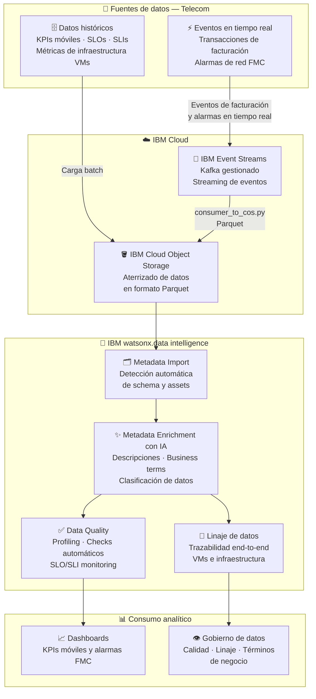
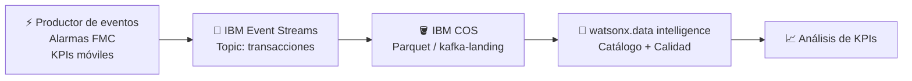
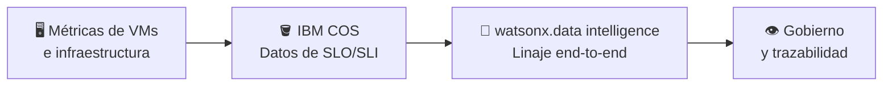

# Telecom — Arquitectura de la Solución

> **Estado:** 🔄 En proceso — MVP en definición y construcción

## Diagrama de arquitectura — Visión general del MVP

---

## Caso 1 — KPI Móvil y Alarmas FMC

## Caso 2 — SLO/SLI y Linaje de VMs

---

## Componentes clave

| Componente | Tecnología IBM | Rol en la solución |
|---|---|---|
| Ingesta en tiempo real | IBM Event Streams (Kafka) | Recibe eventos de facturación y alarmas de red en tiempo real |
| Almacenamiento | IBM Cloud Object Storage | Aterriza los datos como archivos Parquet para análisis |
| Catálogo y gobierno | IBM watsonx.data intelligence | Importa metadata, enriquece con IA y aplica gobierno de datos |
| Calidad de datos | IBM watsonx.data intelligence (DQ) | Monitoreo automático de SLOs/SLIs sobre los datos de red |
| Linaje | IBM watsonx.data intelligence (Lineage) | Trazabilidad completa del dato desde la VM hasta el dashboard |

---

## Flujo de datos

1. Los **eventos de red** (alarmas FMC, KPIs móviles) son publicados en tiempo real en **IBM Event Streams**
2. El pipeline Python (`consumer_to_cos.py`) consume los eventos y los aterriza como **Parquet en IBM COS**
3. **watsonx.data intelligence** detecta automáticamente los nuevos assets, importa el schema y enriquece la metadata con IA
4. Se aplican **checks de calidad automáticos** sobre los datos para monitorear el cumplimiento de SLOs y SLIs
5. El **linaje end-to-end** permite trazar el origen de cada métrica desde la infraestructura hasta los dashboards analíticos
