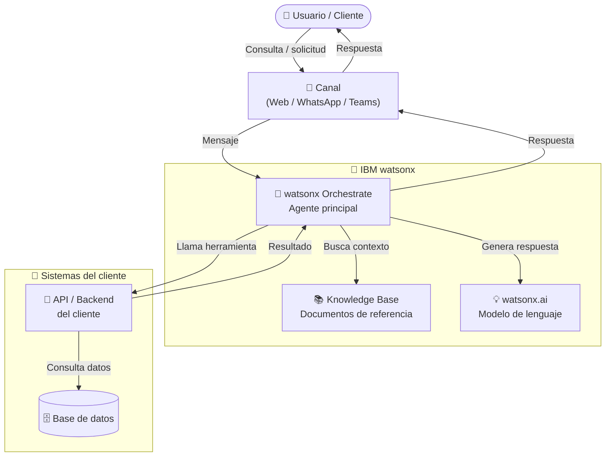

# [Nombre del Proyecto] — Arquitectura de la Solución

<!-- Este documento es el elemento visual central del asset en el portal.
     Mantené el diagrama a nivel de alto nivel — pensado para que un seller o arquitecto
     entienda la solución de un vistazo, sin necesidad de conocimiento técnico profundo. -->

---

## Diagrama de arquitectura

<!-- INSTRUCCIONES PARA EDITAR EL DIAGRAMA:
     1. Reemplazá los nodos genéricos con los componentes reales del proyecto
     2. Usá los nombres exactos de los productos IBM
     3. Eliminá los componentes que no apliquen
     4. Si hay múltiples agentes, mostrá la jerarquía de orquestación
     5. Mantenelo en un solo nivel de abstracción — no mezcles servicios internos con APIs de alto nivel
     
     Productos IBM con sus nombres correctos:
     - IBM watsonx Orchestrate
     - IBM watsonx.ai
     - IBM watsonx.data intelligence
     - IBM Watson Discovery
     - IBM App Connect
     - IBM Code Engine
-->

---

## Componentes clave

| Componente | Tecnología IBM | Rol en la solución |
|---|---|---|
| <!-- Agente principal --> | <!-- watsonx Orchestrate --> | <!-- Orquesta el flujo conversacional y enruta las consultas --> |
| <!-- Base de conocimiento --> | <!-- watsonx Orchestrate (KB) --> | <!-- Responde preguntas frecuentes con documentos cargados --> |
| <!-- Modelo de lenguaje --> | <!-- watsonx.ai --> | <!-- Genera respuestas en lenguaje natural --> |
| <!-- Integración --> | <!-- IBM App Connect / API custom --> | <!-- Conecta con los sistemas legados del cliente --> |

<!-- Agregá o eliminá filas según los componentes reales del proyecto -->

---

## Flujo de datos

<!-- Describí el flujo principal en 3-5 líneas. Lengua de negocio, sin código. -->

1. **El usuario** inicia una conversación a través de [canal]
2. **El agente** [nombre] en watsonx Orchestrate recibe el mensaje y determina la intención
3. Según la intención, el agente consulta la **knowledge base** o ejecuta una **herramienta** que llama a [sistema del cliente]
4. El resultado es procesado y el agente devuelve una **respuesta en lenguaje natural**

---

## Notas de arquitectura

<!-- Decisiones de diseño relevantes, restricciones técnicas, o aspectos a destacar para un arquitecto.
     Opcional — eliminá si no aplica. -->

- **Integración**: <!-- Cómo se conecta con sistemas legados -->
- **Seguridad**: <!-- Manejo de autenticación, datos sensibles -->
- **Escalabilidad**: <!-- IBM Code Engine / contenedores / serverless -->
- **Idioma**: <!-- Español / multilenguaje -->
