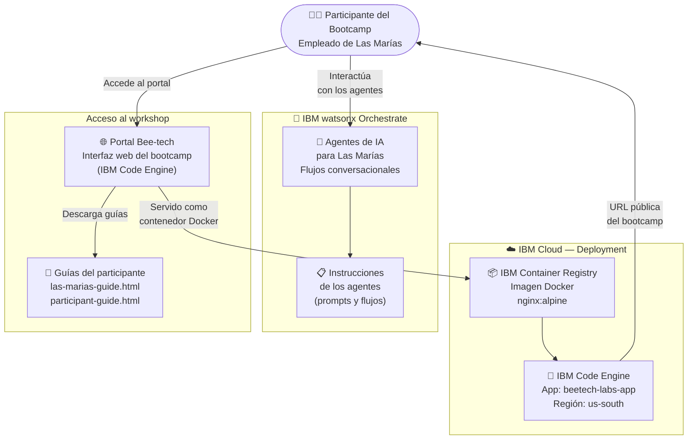

# Bee-tech wxO Bootcamp — Arquitectura de la Solución

## Diagrama de arquitectura

---

## Componentes clave

| Componente | Tecnología IBM | Rol en la solución |
|---|---|---|
| Portal del bootcamp | IBM Code Engine + nginx | Sirve la interfaz web estática del evento (guías, materiales, acceso a agentes) |
| Agentes de Las Marías | IBM watsonx Orchestrate | Agentes conversacionales del caso de uso de la empresa Las Marías |
| IBM Container Registry | IBM Cloud (ICR) | Almacena la imagen Docker del portal para deployment en Code Engine |
| Guías del participante | HTML estático | Documentación del workshop: guía de Las Marías y guía del participante |

---

## Flujo de datos

1. El **participante** accede al portal web del bootcamp, deployado como contenedor en **IBM Code Engine**
2. Desde el portal, el participante accede a las **guías del workshop** (las-marias-guide, participant-guide)
3. Los participantes construyen y prueban **agentes de IA** para el caso de uso de Las Marías en **IBM watsonx Orchestrate**
4. El portal se actualiza mediante **redeploy en Code Engine** cuando hay cambios en las guías o materiales

---

## URL del workshop

🌐 **Portal activo:** [beetech-labs-app.2b6jhfm91b2v.us-south.codeengine.appdomain.cloud](https://beetech-labs-app.2b6jhfm91b2v.us-south.codeengine.appdomain.cloud/index.html)
