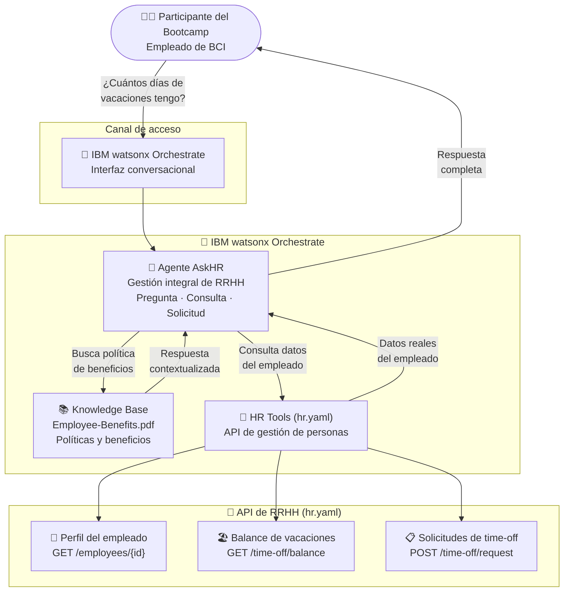

# Bootcamp askHR — BCI — Arquitectura de la Solución

## Diagrama de arquitectura

---

## Componentes clave

| Componente | Tecnología IBM | Rol en la solución |
|---|---|---|
| Agente AskHR | IBM watsonx Orchestrate | Agente de RRHH que responde preguntas y gestiona solicitudes de los empleados |
| Knowledge Base | IBM watsonx Orchestrate (KB) | Documenta políticas de beneficios, vacaciones y procedimientos de RRHH |
| HR Tools | IBM watsonx Orchestrate (Tools) | Conecta con la API HR para leer perfiles, balances y crear solicitudes |
| API HR | OpenAPI (hr.yaml) | Especificación de la API de gestión de personas (perfiles, vacaciones, time-off) |

---

## Flujo de datos

1. El **empleado** hace una pregunta en lenguaje natural sobre beneficios, vacaciones o políticas de RRHH
2. El **agente AskHR** determina si la respuesta está en la **knowledge base** (política) o requiere una **llamada a la API** (datos personales)
3. Para preguntas de política: el agente busca en el documento `Employee-Benefits.pdf` y responde con la información relevante
4. Para consultas personalizadas: el agente llama a la **API HR** para obtener el balance de vacaciones, perfil o crear una solicitud de time-off
5. El empleado recibe una respuesta contextualizada que combina la política y sus datos personales

---

## Objetivo del workshop

Este proyecto se usa como **laboratorio hands-on** para que los participantes aprendan a:
- Crear un agente conversacional con IBM watsonx Orchestrate desde cero
- Configurar una knowledge base con documentos PDF
- Conectar el agente a una API REST usando OpenAPI (hr.yaml)
- Validar el agente con flujos de prueba reales
