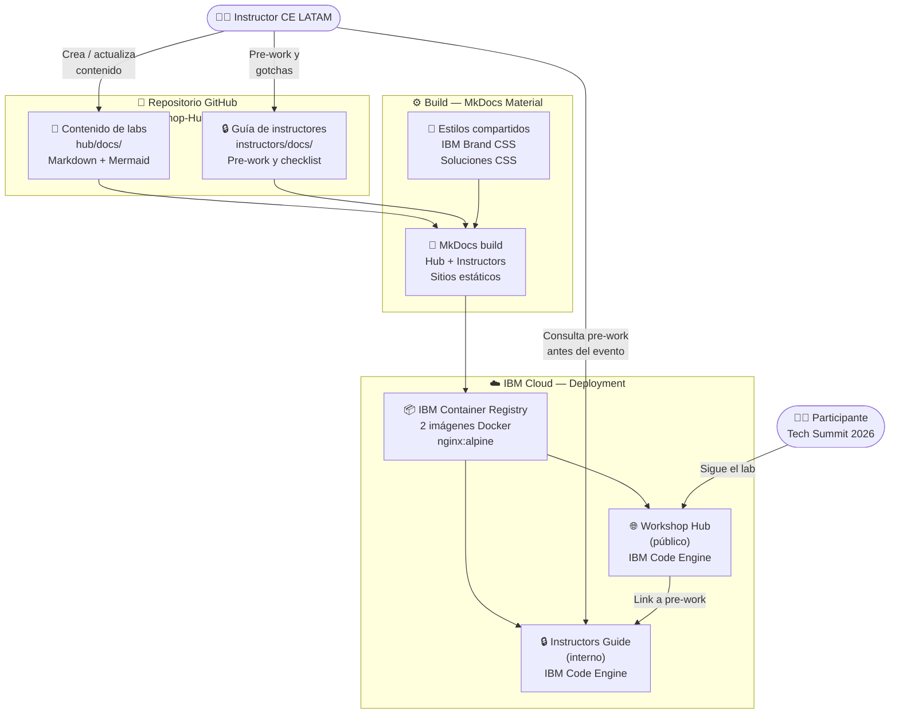

# Tech Summit Labs 2026 — Arquitectura de la Solución

## Diagrama de arquitectura

---

## Componentes clave

| Componente | Tecnología IBM | Rol en la solución |
|---|---|---|
| Workshop Hub | IBM Code Engine + MkDocs Material | Sitio público con los labs paso a paso para participantes |
| Instructors Guide | IBM Code Engine + MkDocs Material | Sitio interno con pre-work, timing y gotchas para instructores |
| IBM Container Registry | IBM Cloud (ICR) | Almacena las imágenes Docker de ambos sitios |
| Estilos IBM Brand | CSS custom (ibm-brand.css) | Identidad visual IBM consistente en ambos sitios |

---

## Flujo de datos

1. El **instructor** crea o actualiza el contenido de los labs en Markdown dentro del repositorio
2. **MkDocs Material** buildea dos sitios estáticos independientes desde la misma base de código: Hub (público) e Instructors Guide (interno)
3. Las imágenes Docker se publican en **IBM Container Registry** y se despliegan como apps separadas en **IBM Code Engine**
4. El **participante** sigue los labs desde el Workshop Hub durante el evento
5. El **instructor** consulta la guía interna para el pre-work, credenciales y gotchas antes y durante el evento

---

## Labs disponibles

El Workshop Hub sigue la taxonomía: `Solución → Grupo de labs → Lab N`

| Solución | Descripción |
|---|---|
| IBM Bob | Labs de desarrollo RPG, modernización Java |
| watsonx Orchestrate | Labs de agentes conversacionales |
| watsonx.ai | Labs de modelos y prompting |
